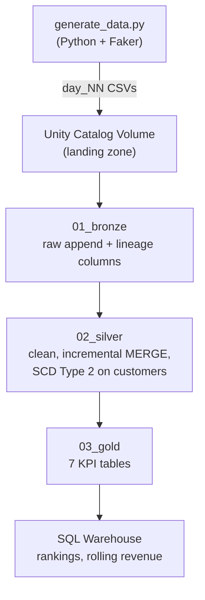

# Retail Analytics Lakehouse

An end-to-end retail analytics data pipeline built on the Medallion Architecture (Bronze → Silver → Gold), using PySpark and Delta Lake on Databricks. The project simulates a real retail source system emitting daily batches of orders, customers, and products, and processes them through incremental loads, SCD Type 2 history tracking, and MERGE-based upserts — all orchestrated as a Databricks Job.

## Architecture



`01_bronze → 02_silver → 03_gold` run as three dependent tasks in a single Databricks Job, parameterized by `day_folder` (which day's batch to process) and `business_date` (the batch's simulated date, used for SCD2 history).

## Tech stack

Python · PySpark · Delta Lake · Databricks (Unity Catalog, Volumes, SQL Warehouse, Jobs) · SQL · Git

## Data model

Three synthetic datasets, generated locally and uploaded to a Unity Catalog Volume as the daily landing zone — a star schema with `orders` as the fact table and `customers`/`products` as dimensions:

| Table | Grain | Notes |
|---|---|---|
| `customers` | one row per customer version | `city`, `state`, `age`, `gender`, `signup_date` |
| `products` | one row per product | `category`, `brand`, `price` |
| `orders` | one row per order | `quantity`, `amount`, `order_ts` |

Each simulated day is a full snapshot: `orders.csv` contains only that day's new orders, and `customers.csv` is a fresh snapshot in which a handful of customers have moved city — this is what drives the incremental load and SCD2 logic below.

## Pipeline layers

**Bronze** — raw ingestion. Each day's three CSVs are read from the landing volume and appended, unmodified, to `bronze_customers` / `bronze_products` / `bronze_orders`, with `_ingested_at` / `_source_file` lineage columns stamped on for traceability.

**Silver** — cleaning and history:
- Deduplication, null handling, explicit type casting, and timestamp parsing (`to_timestamp`, `to_date`)
- **Incremental load**: each day's new orders are merged into `silver_orders` via `MERGE INTO` (upsert on `order_id`), so the job only ever processes that day's batch, not the full history
- **SCD Type 2** on `silver_customers`: customer changes (city/state) are detected via a hash fingerprint of tracked columns, then applied with the staged-merge-key pattern — a `MERGE` that simultaneously closes out the old row (`is_current = false`, `effective_to = <date>`) and inserts the new version (`is_current = true`, `effective_from = <date>`), preserving full history rather than overwriting it
- `silver_orders_enriched`: orders joined against current customer and product dimensions — the table every Gold KPI reads from
- `silver_customer_latest_purchase`: each customer's most recent order, via `row_number()` over a window partitioned by `customer_id`

**Gold** — business KPIs, aggregated off `silver_orders_enriched`: revenue by month / state / category, top 10 products, top 10 customers, average basket value, and repeat customers.

**SQL analytics** — ad hoc analytical queries run on a SQL Warehouse: product and customer rankings (`RANK()`, `QUALIFY`), and rolling/cumulative revenue using window frames (`ROWS BETWEEN UNBOUNDED PRECEDING AND CURRENT ROW`).

## Orchestration

The three pipeline notebooks are wired into a **Databricks Job** with explicit task dependencies (`bronze → silver → gold`) and Job-level parameters (`day_folder`, `business_date`) that push down into each notebook's widgets.

On top of that, an **Airflow DAG** (`retail_lakehouse_daily`, Astro-managed, in `airflow/dags/`) triggers the Databricks Job on a daily schedule via `DatabricksRunNowOperator`, passing Airflow's logical date (`{{ ds }}`) down as `business_date` — so any day can be re-run and still produce that day's result. Airflow is the scheduler; Databricks remains the executor, with the `bronze → silver → gold` dependency graph living in the Job.

## Repository structure

```
generator/generate_data.py   simulated source system — generates daily CSV batches
00_exploration.ipynb         development notebook: full build process, step by step
01_bronze.ipynb              Bronze: raw ingestion (parameterized by day_folder)
02_silver.ipynb              Silver: cleaning, incremental MERGE, SCD Type 2
03_gold.ipynb                Gold: KPI tables
```

## Running it

1. Generate a day's batch locally: `python generator/generate_data.py --day N`
2. Upload the resulting CSVs to `/Volumes/workspace/retail_lakehouse/landing/retail_day_0N/`
3. Trigger the Databricks Job with `day_folder=retail_day_0N` and the matching `business_date`

## Roadmap

- [x] Airflow orchestration (calling the same Databricks Job on a schedule)
- [ ] BI dashboard on the Gold layer
- [ ] Spark Structured Streaming variant
